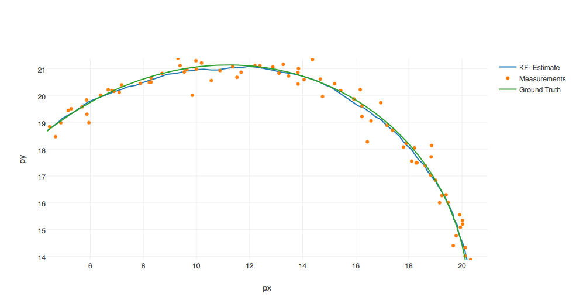

# Unscented Kalman Filter Project

The goals / steps of this project are the following:

* Complete the Unscented Kalman Filter algorithm in C++.
* Ensure that your project compiles.
* Test your Kalman Filter against the sample data. Ensure that the px, py, vx, and vy RMSE are below the values specified in the rubric.
* Normalize angles
* Don't forget to tune parameters and initialize variables
* Check for divide by zero

## [Rubric](https://review.udacity.com/#!/rubrics/783/view) Points
### Here I will consider the rubric points individually and describe how I addressed each point in my implementation.

---
### Compiling
#### 1. Your code should compile.  

The code compiles without errors with cmake-3.7.2 and make-3.81 on macOS-10.12.4.

---
### Accuracy
#### 1. The px, py, vx, vy output coordinates must have an RMSE <= [.09, .10, .40, .30] when using the file: "obj_pose-laser-radar-synthetic-input.txt".

The computationally stable RMSE on `obj_pose-laser-radar-synthetic-input.txt` is `[0.0655022, 0.0817954, 0.148616, 0.208478]`. 5% of NIS estimates are higher than 3.942 (lidar), 6.12856 (radar) - it's well correlating with the Chi-squared distribution for df=2 (5.991) and df=3 (7.815) respectively. Changing the process noise standard deviation of longitudinal (1 m/s^2) and yaw (Pi/5 rad/s^2) acceleration only decreases the overall accuracy.

    

---
### Follows the Correct Algorithm
#### 1. Your Sensor Fusion algorithm follows the general processing flow as taught in the preceding lessons.

The implemented solution follows the Sensor Fusion method, including the Unscented Kalman Filter, which is described in the lesson.

#### 2. Your Kalman Filter algorithm handles the first measurements appropriately.

The first measurement is handled by `UkfTracker::operator()` defined in `ukf_tracker.cpp`.

#### 3. Your Kalman Filter algorithm first predicts then updates.

The method `UkfTracker::Predict` is called before `UkfTracker::Update` in `UkfTracker::operator()`.

#### 4. Your Kalman Filter can handle radar and lidar measurements.

In `ukf_tracker.cpp`, function `PredictRadarMeasurement` computes sigma points, the predicted measurement mean and covariance in radar measurement space. Function `PredictLidarMeasurement` does the same in lidar measurement space. The rest of the code is generic, agnostic to the sensor type.

---
### Code Efficiency
#### 1. Your algorithm should avoid unnecessary calculations.

* All duplicating expensive computations (like floating point multiplications and divisions) are done only once and then the result is reused.
* All computed constants and matrices are moved to a nameless namespace of `ukf_tracker.cpp`.
* Note using kAugWeights.asDiagonal() before multiplying the weight vector with diff-matrices. Even though turning the weights vector into a diagonal might seem inefficient, but this vectorized multiplication demonstrates a significantly better performance, than an explicit loop over sigma points. When all occurrences of such multiplication are replaced with the loop shown in programming quizzes, the completion  time over 8000 samples is about 3s (on an Intel i7). The vectorized completion time is 2.1s. It must be a result of the optimal Eigen matrix multiplication algorithm.

---
### Notes

* The code is complying with the [Google C++ Style Guide](https://google.github.io/styleguide/cppguide.html).
* The main Sensor Fusion class UkfTracker is made a functor, which is easy to plug into an algorithm generating estimations out from measurements, see the use of `std::transform` in function `main` of `main.cpp`
* The C++11 automatic type deduction is used wherever appropriate.
* All function/method comments are made Doxygen-friendly
